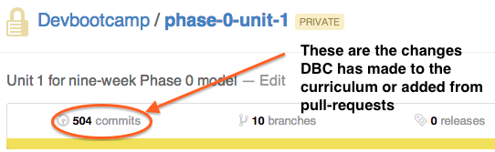

[Week 1 Home](../)

# Introduction to Version Control, git, and GitHub

## Learning Competencies
By the end of this lesson, you should be able to:
- Navigate repositories in GitHub
- Compare git and GitHub
- Explain what version control is and does

## Summary
Web Developers use tools to track their progress and create backups. GitHub is a popular platform for doing this, especially in the open source community. In this introduction, we want to introduce you to GitHub so you don't feel lost when working through the material.

## Releases

## Release 0: GitHub Vocabulary

#### Repositories
You know how you make folders on your computers? In each folder, you can have other folders or files. A GitHub repository is essentially the same as a folder on your computer, except that it's on the web. It can have folders and files. If you take a look at [phase-0-unit-1](../../), you'll see three folders (week-1, week-2, and week-3) listed at the top, and a file called "README.md." Github displays readme files on the main page of a repository by default.

From the main page of a repository, click on the appropriate link to access that week's curriculum. You've already proved you've made it to week-1 by navigating to and reading this challenge.

The readme in each directory will be the main source of instructions that will direct you through the curriculum. Make sure to read all the instructions carefully. If you have questions on instructions, post them in the google+ community.

Challenges will be contained in directories or individual files. You can determine the order of the challenges in two ways:
  1. The readme lists the challenges in order.
  2. The challenges are numbered in the order needed to complete them in the section where directories and files are displayed (above the readme).

Don't overthink the web version of github too much. It's a very similar structure to a computer's file structure you already know.

#### Branches

In git, a branch is a copy of the code from where you branched from. For instance if you branched from the master branch, you new branch would look exactly like the master. This allows you to introduce changes without changing the state of the master, which should always be working. After you have added the features that you want, you can merge your changes with the master, or if you do not own the repo, do a pull request. A pull request is a friendly way of saying: "Hey boss! I'm done implementing this feature your asked for, can you review my code?". When working in a team, it is best practice to have at least 1 other person review your pull request.

You can see your local branches by typing:

`git branch`

If you want to see your local and remote branches, type:

`git branch -a`

#### Commits

A commit is a snapshot of your code that you can go back to at any time. Check out what the commit log looks like for the devbootcamp curriculum repo!

We will talk more about commits in the tracking changes challenge.

## Release 1: What is git?

GitHub uses git for version control. Go through the following resources to learn a bit about what that means.

- Read: [Version Control](http://skillcrush.com/2013/02/11/version-control/)
- Read: Skillcrush's Git Series [Git](http://skillcrush.com/2013/02/18/git/) and [Getting Started with Git](http://skillcrush.com/2013/02/20/get-started-working-with-git/)
- Watch: [Git 3 Minute Primer](http://www.youtube.com/watch?v=_Jmkvv_nKTE)

## Release 2: Git vs. GitHub

Confused about the difference between git and GitHub? Try one of these articles:

- [Git vs. GitHub for Dummies](http://stephaniehoh.github.io/blog/2013/10/07/git-vs-github-for-dummies/)
- [Is Git the same as GitHub?](http://www.jahya.net/blog/?2013-05-git-vs-github)

## Release 4: Reflection
Reflecting is essential for solidifying your learning. You will be expected to complete a reflection for each challenge in Phase 0. It will help you learn how you learn, give opportunities for sharing resources, and help your instructors gauge your progress. Reflections are for you, but they will also be read by others, so make sure to write for an audience.

**Writing reflections for each challenge is mandatory.**

Reflect on your learning in this challenge by editing the my_reflection.md file in the [2_github_intro](./) folder (the folder you are in). You will be learning HTML this week, but these files have a `.md` extension. Do you know what that stands for? It stands for markdown, which is a text-to-HTML conversion tool.  If you would rather write in HTML, you can do that by changing the file extension from .md to .html.

You can complete the first challenge reflections on github.com. Click on the my_reflection.md file in this folder. There should be a button to edit (it looks like a pencil) at the top. Click it. You'll add your reflection in markdown and write a commit message under "Commit changes" to describe the changes you made. Once you type something there, you will want to click the "commit changes" button. **NOTE: It will not let you commit changes without a commit message.**

Once you press "commit changes," your new file should be automatically visible on your www.github.com/[USERNAME]/phase-0-unit-1 directory.

After you learn how to edit files locally and push your changes (in the next challenge), you'll want to read and edit all files on your local `phase-0-unit-1` repository--more on that later.

