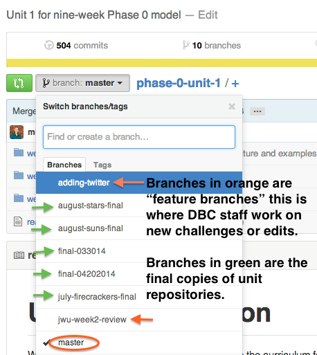

[Week 1 Home](../)

# Introduction to Version Control, git, and GitHub

## Learning Competencies
By the end of this lesson, you should be able to:
- Navigate repositories in GitHub
- Compare git and GitHub
- Explain what version control is and does

## Summary
Web Developers use tools to track their progress and create backups. GitHub is a popular platform for doing this, especially in the open source community. In this introduction, we want to introduce you to GitHub so you don't feel lost when working through the material.

## Releases

## Release 0: GitHub Vocabulary

#### Repositories
You know how you make folders on your computers? In each folder, you can have other folders or files. A GitHub repository is essentially the same as a folder on your computer, except that it's on the web. It can have folders and files. If you take a look at [phase-0-unit-1](../../), you'll see three folders (week-1, week-2, and week-3) listed at the top, and a file called "README.md." Github displays readme files on the main page of a repository by default.

From the main page of a repository, click on the appropriate link to access that week's curriculum. You've already proved you've made it to week-1 by navigating to and reading this challenge.

The readme in each directory will be the main source of instructions that will direct you through the curriculum. Make sure to read all the instructions carefully. If you have questions on instructions, post them in the google+ community.

Challenges will be contained in directories or individual files. You can determine the order of the challenges in two ways:
  1. The readme lists the challenges in order.
  2. The challenges are numbered in the order needed to complete them in the section where directories and files are displayed (above the readme).

Don't overthink the web version of github too much. It's a very similar structure to a computer's file structure you already know.

#### Branches

In git, a branch is a snapshot of your files that you can work on separately. For instance if you created a new branch called feature-branch and you were currently on the master branch, feature-branch would look exactly like the master. This allows you to introduce changes without changing the state of the master. After you have added the features that you want, you can merge your changes with the master, or if you do not own the repo, do a pull request. A pull request is a friendly way of saying: "Hey boss! I'm done implementing this feature your asked for, can you review my code?". When working in a team, it is best practice to have at least 1 other person review your pull request.

If you look at devbootcamps phase-0-unit1 branches, you can see that we use branches to save what the curriculum looked like at the end of every cohort.

You can see these branches on your teminal by typing:

`git branch -a`

Notice that branches on your local repo just appear as

feature-branch

where branches from the remote appear as

remote/feature-branch

#### Commits

In short, a commit is a save point in your code. You can use commits as mile markers to go back to or to check on the state of files when you were adding some feature. We created a whole section on how you can use commits and why they are important.

Check out the tracking changes challenge [here](../4-tracking-changes).

## Release 1: What is git?

GitHub uses git for version control. Go through the following resources to learn a bit about what that means.

- Read: [Version Control](http://skillcrush.com/2013/02/11/version-control/)
- Read: Skillcrush's Git Series [Git](http://skillcrush.com/2013/02/18/git/) and [Getting Started with Git](http://skillcrush.com/2013/02/20/get-started-working-with-git/)
- Watch: [Git 3 Minute Primer](http://www.youtube.com/watch?v=_Jmkvv_nKTE)

## Release 2: Git vs. GitHub

Confused about the difference between git and GitHub? Try one of these articles:

- [Git vs. GitHub for Dummies](http://stephaniehoh.github.io/blog/2013/10/07/git-vs-github-for-dummies/)
- [Is Git the same as GitHub?](http://www.jahya.net/blog/?2013-05-git-vs-github)