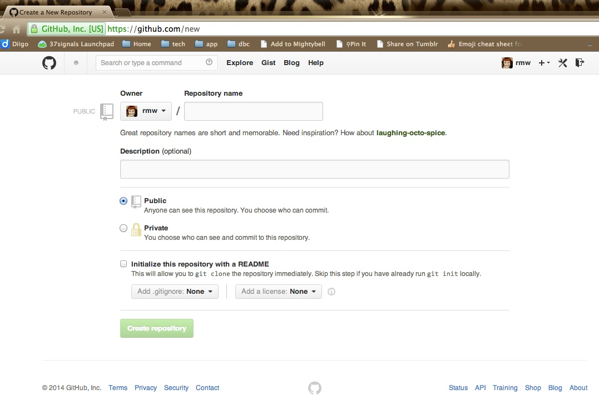
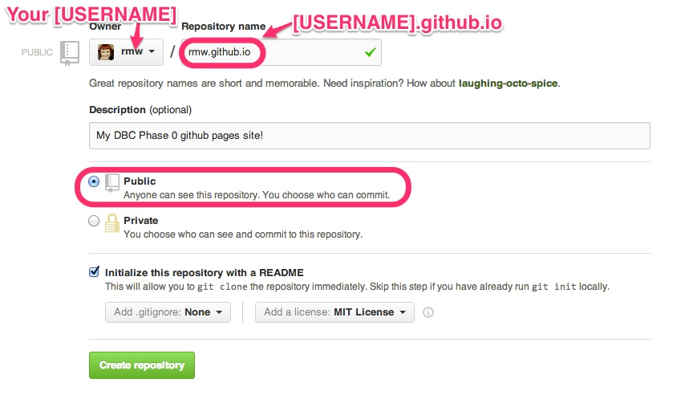
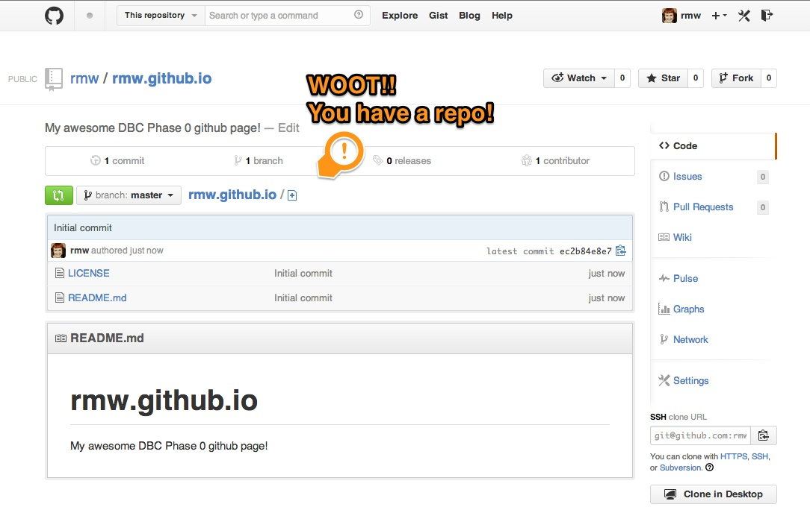

[Back](README.md)

# Set up a repository

We are going to create a repository to host your very own website! You'll be using a GitHub repository and [GitHub Pages](http://pages.github.com/) to set it up.

## Learning Competencies

- Explain how to create a repository on GitHub and clone a repository to your local computer
- Describe "open source"
- Assess the importance of using licenses 

## Release 0: Create a website repository

1. **Log into GitHub**
2. **Create a [new repository](https://github.com/new)**  This will take you to the new repository form.  
3. **Fill out the new repository form.** <ul><li>You *must, must, must* name your repository **[USERNAME].github.io**.</li><li>Your repository should be *public*.  </li><li>Check "Initialize this project with a README" and add an MIT license. </li></ul>  I'm gonna say it again: You *must, must, must* name your repository **[USERNAME].github.io**. If you have trouble, double check you spelled it right. 
4. Click on the **"Create Repository" button**
5. Click on **settings** on the "Features" section, add a check next to "Issues." This will allow others to give you feedback on your site!
6. **Do a celebration dance!**  :dancers: :tada: :dancer:   

## Release 1: Download the repository

A git repository is "distributed", which means it exists on many computers instead of just one.  Right now your repository exists on GitHub, but in order to add or edit files, you need it to exist on *your computer*.

In git terms, this is called **cloning a repository locally**. A "local repository" is the copy on your computer. A "remote repository" is one on another server, i.e. on GitHub, or on another person's computer.  

#### Cloning a repository with the command line
Now we want to bring the repository to our computer. There is a series of commands we can use to do this.

The first step is to get the URL of the repo. This is found here:

Mine says SSH URL. If you have your SSH key set up with Github you can use this. Otherwise click HTTPS and use that URL. Copy this URL to your clipboard.

Now you can open your command line, navigate to the directory where you want to add this file using `cd` and then type this command:

`git clone URL_THAT_YOU_COPIED `

If you are using HTTPS, you will be prompted to enter your github user name and password.

Now you should see some stuff execute, it looks like your hacking a mainframe in the 90s. 

After the command prompt appears again execute this command:

`ls`

Now you should see the folder with the same name as the repo you cloned! Navigate into this folder with `cd` and poke around.

## Release 2: Open Source

You added an MIT License to your repository.  Read these articles to explain why:

* [Open Source](http://skillcrush.com/2012/08/29/open-source-software/) 
* [Open Source licensing](http://www.slideshare.net/CodeMontage/writespeakcode-open-source-licenses) 
* [A short guide to Open Source](http://www.smashingmagazine.com/2010/03/24/a-short-guide-to-open-source-and-similar-licenses/)

## Release 3: Reflect

Reflect on your learning by editing the my_reflection.md file in the [2_set_up_repo](./) folder (the folder you are in). Please answer to the questions in the file. 

You can complete the first 2 challenge reflections on github.com. Click on the my_reflection.md file in this folder. There should be a button to edit at the top. Click it. You'll add your reflection in markdown and write a commit message under "Commit changes". Once you type something there, you will want to click the "commit changes" button. **NOTE: It will not let you commit changes without a commit message.**
