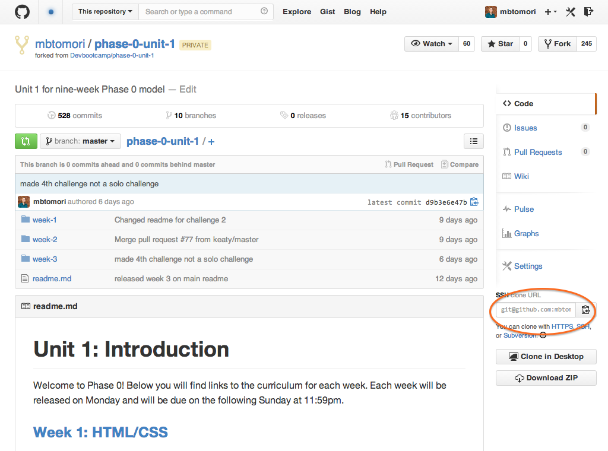
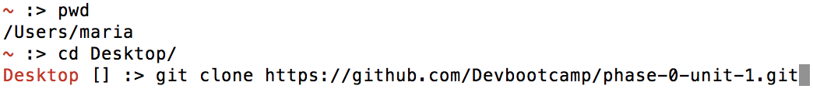

[Week 1 Home](../)

#U1.W1: "Git" Started

## Learning Competencies
- Clone a remote directory to a computer
- Use git commands in the terminal
- Fetch changes from a forked repository
- Push and pull your own changes between your local and remote repositories

## Summary:
In the previous challenge you learned a bit about version control, git, and GitHub. You also created your own fork of the curriculum.

In this challenge, we are going to create a copy of the phase-0-unit-1 repository on your computer and learn basic git commands.

## Releases

## Release 0: Install Git
Since you already installed git in the [computer setup](../1-computer-setup) challenge, you will now want to generage SSH keys and get git setup. Use these [set up git](https://help.github.com/articles/set-up-git) instructions (including generating SSH keys).

## Release 1: Clone the Repository
A git repository is "distributed", which means it exists on many computers instead of just one.  Right now your repository exists on GitHub, but in order to add or edit files, you need it to exist on your computer.

In git terms, this is called **cloning a repository locally**. A "local repository" is the copy on your computer. A "remote repository" is one on another server, i.e. on GitHub, or on another person's computer.

#### Cloning a repository with the command line
Now we want to bring the repository to our computer. There is a series of commands we can use to do this.

First, open your terminal and check where you are (type `pwd`). You NEVER want to clone a repository into another local github repository, so **always** make sure you are the correct directory, like your Desktop or a phase-0 folder.

The first step is to get the URL of the repo. This is found here:

Mine says SSH URL. If you have your SSH key set up with Github you can use this. Otherwise click HTTPS and use that URL. Copy this URL to your clipboard.

`git clone URL_THAT_YOU_COPIED `

If you are using HTTPS, you will be prompted to enter your github username and password. (You won't be able to see what you type, when you finish entering your username, press enter. You will then be prompted to enter your password -- press enter when you're finished).

Now you should see some stuff execute, it looks like you're hacking a mainframe from the 90s.

After the command prompt appears again, execute the command `ls`. You should now see the folder with the same name as the repo you cloned! Navigate into this folder with `cd` and open it in Sublime.

Once you have it open in sublime, you can see all of the files and directories. Find the directory this file is in, and open the "readme.md" file. From now on, you should read all instructions and complete all challenges in sublime. This will help you read and write markdown as well as better understand the file tree. Take a look at the links to images, for example. Do you know what the `../` does? If not, find out!

## Release 2: Git in the Command Line
Read/Watch any of the resources listed below. Work to get a feel for how git and Github works. Then make sure you use it from now on! Make sure to commit early and often. If you make any mistakes, you can always revert to any commit, so commit often!

- [Try Git](https://try.github.io/)
  - A small note about the command `git init`, if you clone from github, you do not have to use git init. The .git folder that it creates is already created for you in the files you are bringing to your computer. `git init` should only be used if you are creating a git repo from scratch on your computer with the intention of pushing it up to github. Executing 'git init' multiple times can cause strange bugs to happen down the road!
- [VIDEO: How to Use Git and GitHub](https://www.youtube.com/watch?v=tRTckrrCME4&list=PLHPcpp4e3JVrR1OCuUAAWLmWEVKok7zAq)
- [GitHub for Beginners, Don't Get Scared, Get Started](http://readwrite.com/2013/09/30/understanding-github-a-journey-for-beginners-part-1#awesm=~oCnoK6Ohf5NlNs)
- [LearnGitBranching](http://pcottle.github.io/learnGitBranching/)

## Release 3: Define basic commands
In your [my_solution.md](my_solution.md) file, describe what each command listed there does.

## Release 4: Use git
Commit your files and push any changes you've made to your remote repository using the command line!

## Release 5: Write a git workflow
Give yourself a little cheatsheet (in order) of commands you'll need to:
- Push files to a remote repository
- Fetch changes (from DBC's master repo to your forked, local repo)
- Commit locally

## Release 6: Git errors
If you encountered any errors or things that were confusing in the terminal, copy the error and do some research on it. See if you can fix it. If not, ask for help understanding it on the community.
Once it's fixed, see if you can explain what the issue was.

## Release 7: [Reflect](https://github.com/Devbootcamp/phase-0-handbook/blob/master/coding-references/reflection-guidelines.md)
In the reflection section of your [my_solution.md(my_solution.md)] file, reflect on your learning using the [reflection guidelines](https://github.com/Devbootcamp/phase-0-handbook/blob/master/coding-references/reflection-guidelines.md). ***NOTE: Reflections are mandatory!***

Use your newly-developed git muscles to commit and push your changes to your repository on GitHub. Make sure you can see it online!

## Release 8: Review
[Review others' solutions](https://github.com/Devbootcamp/phase-0-handbook/blob/master/coding-references/review.md) by leaving an issue. Compare their definitions and workflow to yours. Did you have trouble understanding Git or Github? Did they have trouble? Provide actionable, specific, and kind feedback. (You are expected to leave at least two comments for this challenge).

If you aren't able to leave issues for other students, give them a friendly reminder to enable issues on their repository!

