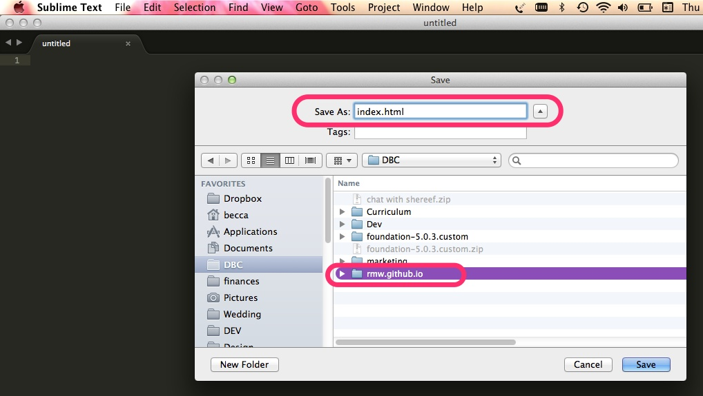
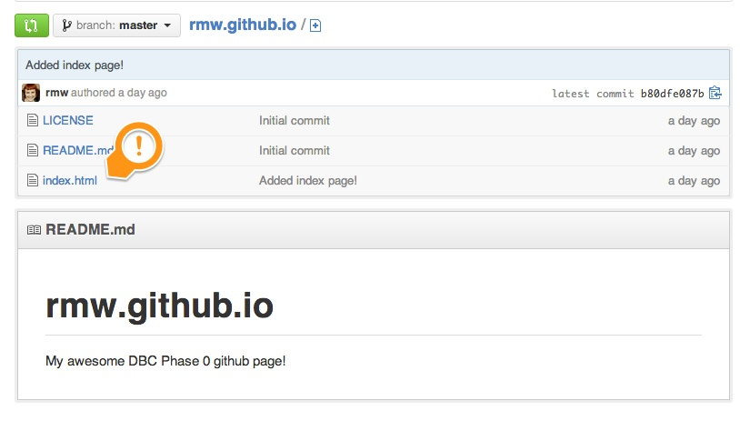

[Back](README.md)

# Basics of the Web

## Learning Competencies

- Describe the following: web server, browser, HTML, CSS, domain, DNS
- Create an HTML file
- Commit and push a file to GitHub

## Release 0: Learn

#### Web Concepts

* Slides: [Intro to Web Concepts](http://girldevelopit.github.io/girldevelopit-rdu-access/classslides.html#/)
* Read: Web concepts -- [Internet vs. Web](http://skillcrush.com/2012/08/19/the-internet-vs-the-web/), [Web Browser](http://skillcrush.com/2012/10/01/web-browsers/), [Web Server](http://skillcrush.com/2012/07/03/web-server-2/)
* Read: [Web site vs Web App](http://skillcrush.com/2013/03/28/websites-vs-web-applications/)
* Read: Domain concepts -- [What's a domain](http://skillcrush.com/2012/11/01/domain-2/), [DNS](http://skillcrush.com/2012/04/24/dns/), [IP Address](http://skillcrush.com/2012/07/03/ip-address-2/)
* Read: [Introduction to DNS](http://coding.smashingmagazine.com/2011/05/25/introduction-to-dns-explaining-the-dreaded-dns-delay/)
* Read: [What's HTML?](http://skillcrush.com/2012/04/02/html/)

#### More about Git

* Read: [Recording Changes to your Git Repository](http://git-scm.com/book/en/Git-Basics-Recording-Changes-to-the-Repository)

**Optional resources**

* Read: [git commit](https://www.atlassian.com/git/tutorial/git-basics#!commit)
* Read: [git log aka git history](https://www.atlassian.com/git/tutorial/git-basics#!log)

## Release 1: Create a web page

Now let's put that knowledge to work!  We will be using [Sublime Text](http://www.sublimetext.com/) as our [text editor](http://skillcrush.com/2012/09/10/text-editor/).  Review the [Perfect Workflow in Sublime Text](http://code.tutsplus.com/articles/perfect-workflow-in-sublime-text-free-course--net-27293) if you need a refresher on how to write code using Sublime.

* **Open a new file in Sublime**
* Save the file as `index.html` in the **same directory as your copy of [USERNAME].github.io**  
* Add the following **HTML code** to your file: `<html><body>Hello DBC!</body></html>`
* **Save the file**

## Release 2: Save your page to GitHub
Navigate in your command line to your [USERNAME].github.io folder using `cd`
type in `git status` 
you should see something like this:

Red means modified but not staged for commit. We want to stage this so we can save our work!

Type in `git add [WHAT_YOUR_FILE_IS_CALLED]` you can use tab to help auto complete your names.

now type in `git status` again, now your files should be green!

We are ready now to commit these changes. Use this command:

`git commit -m "then type a message with quotes around it to describe what you changed"`

the m stands for message. If you want you can use -v (verbose) to type a longer message in your default text editor.

## Release 3: Push your page to GitHub

Now that we have all of our changes saved with commit. It is time to push these changes to the remote repo. We are going to use this command:

`git push origin master` 

push takes 2 options, the name of the remote repo, which is origin in our case, and which branch to push. Since we have not created our own branch we are currently on the  `master` branch. If you dont believe me you can type `git branch` and see for yourself.

Generally we want to do work on branches other than master then do a pull request, which our co-workers will review. This maintains the integrity of the master branch and prevents your production code from the bugs of development.

After your push is done, your remote repo which lives on github.com will be updated.

## Release 4: View your site

It's now time for the big reveal!! 

Go to **http://[USERNAME].github.io** to see your HTML page live! 
*NOTE: It can sometimes take up to 15 minutes to update the site after creating your repo, so if you run into a 404 error, be patient and check again later.*

You can also see the new index.html file in your GitHub repository!

#### [AMAZING!](http://www.youtube.com/watch?v=ewfIvKbuRUg)

## Release 5: Reflection

Now you will want to practice what you've learned in this challenge (and don't worry, you'll get to go through this reflection workflow for the rest of phase 0).

In the GitHub app (or via your terminal), go to your [USERNAME]/phase-0-unit-1 repository (that you forked in challenge 1). Clone it to your computer. Then, open the terminal and navigate to that repository. Open the repository in Sublime. You can do this by either adding sublime shortcuts to your command line or opening sublime and opening the repository from there. 

Navigate to the 3_web_basics/my_reflection.md file. Answer the questions there. Save your file, commit your changes, and sync the repo. You should be able to see your reflection on your forked repo on github.com.

You should edit all code, reflections, etc. from your local text editor. It's bad practice to make changes from github.com. (So forget we told you to do that in the past two challenges)! 

