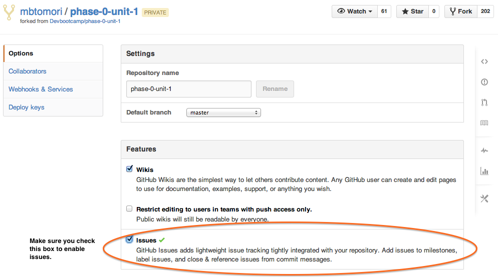

[Week 1 Home](../)

# Set up a repository

We are going to create a repository to host your very own website! You'll be using a GitHub repository and [GitHub Pages](http://pages.github.com/) to set it up.

## Learning Competencies

- Describe "open source"
- Assess the importance of using licenses

## Summary

## Releases

## Release 0: Create a website repository

1. **Log into GitHub**
2. **Create a [new repository](https://github.com/new)**  This will take you to the new repository form.

3. **Fill out the new repository form.**
 - You *must, must, must* name your repository **[USERNAME].github.io**.</li><li>Your repository should be *public*.
 - Check "Initialize this project with a README" and add an MIT license.

 

 I'm gonna say it again: You *must, must, must* name your repository **[USERNAME].github.io**. If you have trouble, double check you spelled it correctly.

4. Click on the **"Create Repository" button**

5. You should now be on the main repo page. On the right side, click on **settings**. In the "Features" section, add a check next to "Issues." This will allow others to give you feedback on your site!
6. 

6. **Do a celebration dance!**  :dancers: :tada: :dancer:

## Release 1: Clone the repository

Now we want to bring the repository to our computer like we did in the last challenge. There is a series of commands we can use to do this.

The first step is to get the URL of the repo. This is found here:

Mine says SSH URL. If you have your SSH key set up with Github you can use this. Otherwise click HTTPS and use that URL. Copy this URL to your clipboard.

Now you can open your command line, navigate to the directory where you want to add the repo using `cd`

**MAKE SURE that you are not in your phase-0-unit-1 directory. You should be in a separate folder.**

Your files should look like this

<b>NOT</b> like this

in the folder that you want to clone the files (in my case dbc_stuff) type:

`git clone URL_THAT_YOU_COPIED `

If you are using HTTPS, you will be prompted to enter your github username and password.

After the command prompt appears again, execute the command `ls`. You should now see the folder with the same name as the repo you cloned! Navigate into this folder with `cd` and poke around.

If you've already tried visiting **[USERNAME].github.io** only to be greeted with a *404 page not found* error, do not despair! This is because you haven't actually built any pages yet, which is something you will be doing later. It also sometimes takes 10 minutes to become viewable.

## Release 2: Open Source and Licenses

You added an MIT License to your repository. Read these articles to explain why:

* [Open Source](http://skillcrush.com/2012/08/29/open-source-software/)
* [Open Source licensing](http://www.slideshare.net/CodeMontage/writespeakcode-open-source-licenses)
* [A short guide to Open Source](http://www.smashingmagazine.com/2010/03/24/a-short-guide-to-open-source-and-similar-licenses/)

## Release 3: Reflect

Reflect on your learning by editing the my_reflection.md file in the [4-set-up-repo](./) folder (the folder you are in) using **Sublime**. Please answer the questions in the file. Using your new git and GitHub skills, commit and push your changes to your remote repository! Make sure you can see the changes on GitHub!
