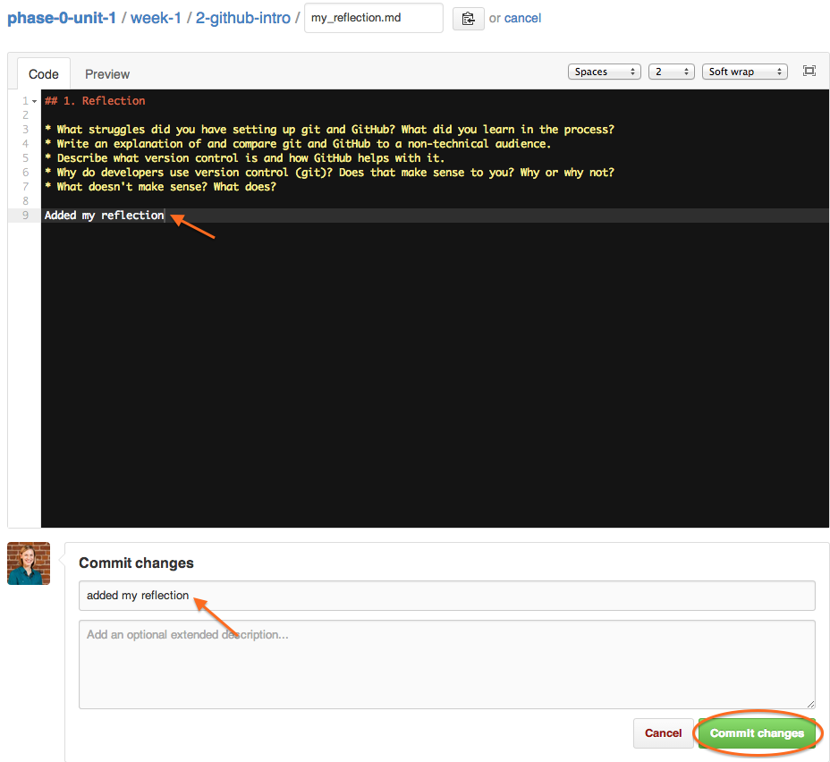

[Week 1 Home](../)

# U1.W1: Fork and Clone

## Learning Competencies
- Explain how and why to fork a GitHub Repository
- Clone a fork onto a local machine.

## Summary
Now that you are a bit familiar with the idea of version control and git, you will learn how to get your own copy of this repository which is where you will keep your work (including those reflections you've already written!).

Even though GitHub has a desktop app, we want you to continue using git on the command line instead. We have numerous reasons for this, namely that the app hides the processes that are actually going on, it doesn't have the same functionality as the command line, and no programmers actually use it, so it's better to get used to the right tools early. You will want to feel confident using git on the command line when you get into Phase 1.

## Releases

## Release 0: Watch
We created this handy video walking through the process of forking and cloning your curriculum.

You can also see a review of these steps [here](fork-clone-steps.md).

## Release 1: Fork

Now that you have seen it done, put your knowledge to the test. Fork the [phase-0-unit-1](../../) repo into your GitHub account. For good measure, delete your newly-forked repo and fork it again. It is good to walk through the process a couple times to make sure you understand it. If you can do it without referencing the video you are in a good spot.

## Release 2: Enable Issues
You will be using issues to give/receive feedback to/from other students in Phase 0. This is a "feature" on GitHub, so it's vital you enable them in your repository.

Go to the repository settings, located on the bottom right of the right navigation bar. Check the "Issues" box.

**Please note** Your repository will be private by default. That is intentional. But others in Phase 0 will have access to see your code and will be able to give you feedback because you are all on the same team (and have issues enabled). Please do not make your repository public.

## Release 3: Clone

Now you have your own fork of the curriculum on github.com just waiting to be modified. It's time to bring it to your computer so you can add your work. Clone your **forked** repo using the instructions from the video.

Delete your local copy (using the command line) and clone it again. Get familiar with the commands and the steps to get a file from github to your computer.

Now that you have your own fork and a local copy of the files to work with, you can share your knowledge with the world. Find someone/thing that will listen to you for 10 minutes and teach them how to fork and clone a repo. Wouldn't it be great if your dog could do this for you?

## Release 4: Reflect
Now you can finally add your reflection to the challenge itself! Reflect on your learning in this challenge by editing the [my_reflection.md](my_reflection.md) file in the [3-fork-and-clone](./) folder (the folder you are in). These files are written in [markdown](http://daringfireball.net/projects/markdown/syntax), which is a text-to-HTML conversion tool. It's so easy, you just need to type as you normally would to add your reflections.

You can complete this challenge reflection on github.com. Click on the [my_reflection.md](my_reflection.md) file in this folder. There should be a button to edit (it looks like a pencil) at the top. Click it. You'll see questions from the first challenge as well as this one. Add your reflection in markdown and write a commit message under "Commit changes" to describe the changes you made. Once you type something there, you will want to click the "commit changes" button. **NOTE: It will not let you commit changes without a commit message.**

Once you press "commit changes," your new file should be automatically visible on your www.github.com/[USERNAME]/phase-0-unit-1 directory.

After you learn how to edit files locally and push your changes (in the next challenge), you'll want to read and edit all files on your local `phase-0-unit-1` repository using Sublime--more on that later.

