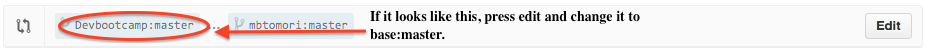
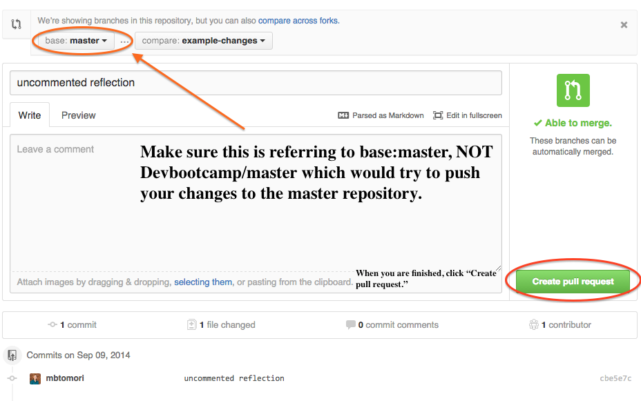
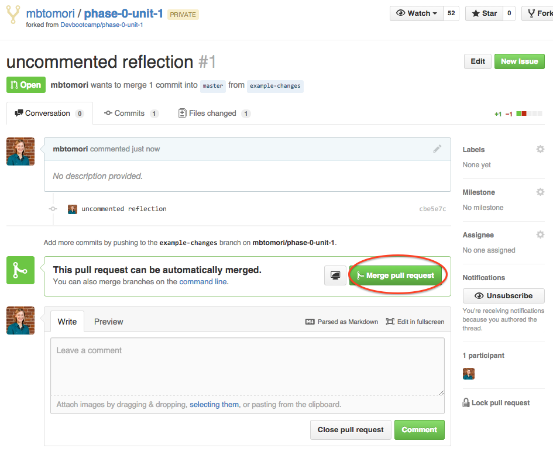
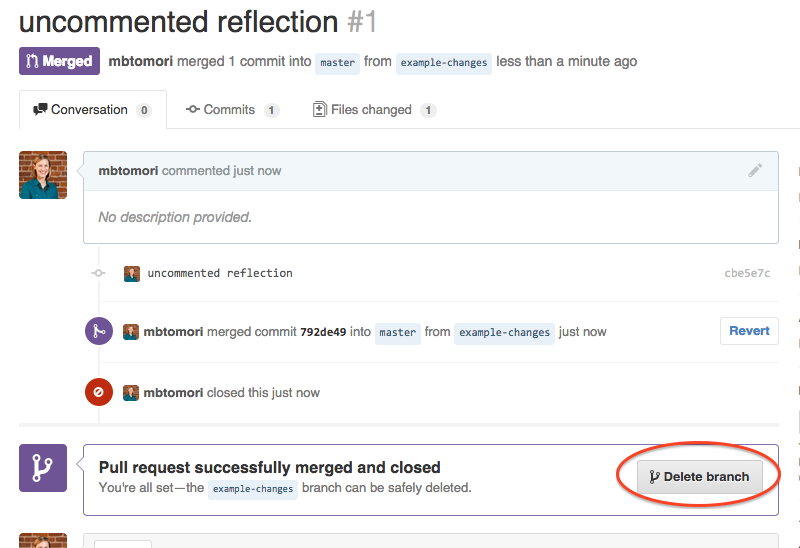

# Making Pull Requests

You can make a new branch at any time, from any branch by typing:

```shell
$ git co -b new-branch-name (replace "new-branch-name" with the name of the branch you want).
```

You can then push this branch to GitHub.

```shell
$ git push origin new-branch-name
```

This will push your changes from your local machine (origin) to the branch you specified. Now go look at your fork on GitHub. You should be see that branch in the drop-down menu. Click on it.

Right below the branch drop-down will be a grey bar that has pull request and compare on the right.


Click on "pull request." This will show you a summary of the files that were changed. At the top, it will show you which branch you are making the pull request on. Make sure to change it from Devbootcamp:master to base:master.



Once you have the correct branches, you may want to put a comment in on what you changed, or just press "Create pull Request."



This is normally where you would stop as a contributor to a project, since it's not good practice to merge your own changes either. But since you are the only collaborator, you'll need to go through the extra two steps.

***

# Merging changes

Since you know you want to merge those changes, you'll need to click on the pull request you just made, and click "Merge pull request." If it's not on your screen, click on the pull-request icon in the vertical navigation bar to the right of your screen.



It will ask you to confirm the merge, so make sure you do that. Then you'll want to clean up your branches and delete that extra branch you made by pressing the "Delete branch" button.



# Making improvements to DBC's curriculum!

So this process is really empowering to you as well. If you notice a typo in Devbootcamp's curriculum, or any other problems, you can actually make improvements yourself using this process and create a pull request to have them merged. Just make sure you are careful about which changes you make a pull request for. Any changes that add personal content will be rejected.

The only thing you will want to make sure you do is keep Devbootcamp:master as the branch you want to compare to make the pull request. Be sure to add good comments about the changes you made. It will make it easier for us to approve them.
