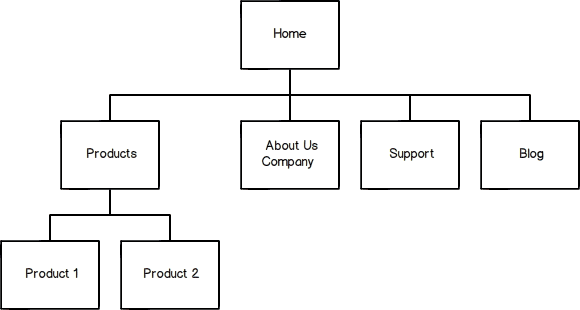

[Week 2 Home](../)

# U1.W2: Intro to Design

## Learning Competencies
- List and use the 6 Phases of Web Design
- Describe user experience design

## Summary
Many people think "web design" simply means how the site looks. This couldn't be further from the truth! The practice of web design centers around usability, navigation, and accessibility.

Regardless of whether design is interesting to you or not, web design
matters to end users. If your site isn't easy to read, navigate, or access, you will lose users.

In this challenge, you will learn about design thinking and take the first steps toward creating your own personal Phase 0 website.

## Releases

## Release 0: Intro to Design Thinking
Like software engineers, designers are problem solvers. They just solve problems visually instead of with code. For some of you, this may come really naturally;
for others it may not. Both are O.K. Read the following resources below to get background on design thinking.

- [6 Phases of the Web Design and Development Process](http://www.idesignstudios.com/blog/web-design/phases-web-design-development-process/#.UxuuUuddUtU)
- [Design is about solving problems](http://www.smashingmagazine.com/2011/08/24/design-solving-problems/)
- [What is User Experience Design?](http://uxdesign.smashingmagazine.com/2010/10/05/what-is-user-experience-design-overview-tools-and-resources/)
- [Design for performance](https://speakerdeck.com/lara/design-for-performance)

## Release 1: Information Gathering
The first step in creating a website is defining its purpose and target audience. You must know your site's goals and end users before you can think about its layout or design.

In this unit, you'll be creating your own Phase 0 website where you'll post your weekly blog entries. It will be used after your graduate as a portfolio, so think about what content you'd like to see on there.

You'll definitely want to include:

 - Links to your social networks (Twitter, facebook, linked-in, quora, github etc. Basically anything from Socrates except for Tumblr, unless you have a tumblr blog you want to add as well)
  - Your picture
  - Your contact information
  - Link to your blog
  - About me
  - Your projects
  - Anything else you want to include

## Release 2: Site Plan Reflection

Based on your research above, navigate to the [my_reflection.md](my_reflection.md) page for this challenge to answer questions in the Site Planning section.

## Release 3: Site Map

Site maps illustrate the heirarchy of your website in diagram form. They visually explain the relationships between pages of content on your website, making it easier for you to conceptualize how information flows to the user. You can also begin to think about what languages and elements you will need to best present this information to the user.

Site maps should be reflections of your site. So if you have a simple site with only a few pages, you will probably only have a couple boxes of information underneath your index. If you have a very complex site, you might have more, with several levels. Here is an example of a basic site map.

Now you'll create a site map for your site! You can draw the map, though you are also welcome to use tools such as Adobe Photoshop, [http://writemaps.com](WriteMaps), or [http://slickplan.com](Slickplan).

For now, your site map will probably be really simple -- maybe an index page with a few supplemental pages. But as you expand your portfolio and grow your site, you may find yourself adding more and more pages. The great thing about a site map is that it can grow and change with your website.

## Release 4: Add your Site Map
You'll want to save a copy of your site map as "site-map" and add it to your [my_reflection.md](my_reflection.md) file using the following commands.

Use the command line for each step below:
  1. Navigate to the week-2/imgs directory
  2. Move your "site-map" image to the imgs directory.
  3. Using markdown, display your image inline in your [my_reflection.md](my_reflection.md) file associated with this challenge.

  HINT: You can either reference markdown's documentation or look at the way images are used in this repo.

## Release 5: Site Map Reflection

Edit the [my_reflection.md](my_reflection.md) file associated with this challenge using sublime. Commit your changes and push them to GitHub.

## Additional Resources:
- [http://cognition.happycog.com/article/why-developers-need-to-learn-design](Why Developers Need to Learn Design)
- [http://webdesign.tutsplus.com/articles/planning-a-design-project--webdesign-13277](Planning a Design Project)
- [http://bigseadesign.com/web-design/planning-and-scheming-how-we-start-a-web-design-project](Planning and Scheming: How We Start a Web Design Project)