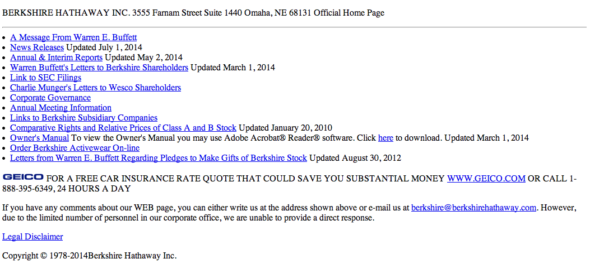

[Week 2 Home](../)

# U1.W2: Beginning HTML

## Learning Competencies
- Set up a basic HTML page with the appropriate tags (html, head, title,etc.)
- Add paragraphs, headings, links, images, lists, and/or tables
- Divide content on a page using divs and spans

## Summary
In this challenge, you will be building an html-only clone of [Berkshire Hathaway's website](http://www.berkshirehathaway.com/). It's a pretty simple site, but can be done in various ways.

It's ok if the site isn't an exact copy. It should just be as close as you can make it. Remember to time box!

If you want to pair on this, we recommend going through Release 0 by yourself. Then get together with your pair for releases 1 and 2.

## Releases

## Release 0: Learn Basic HTML

- Go through [codecademy](http://www.codecademy.com/en/tracks/web) sections:
  - HTML Basics
  - HTML Basics II (Sections 1-6 Only. Skip the styling sections.)
  - HTML Basics III

## Release 1: Set up your HTML Page
It's time to use the tools you learned in codecademy. In the [my-berkshire-site.html](my-berkshire-site.html), set up your webpage using the appropriate tags. You should have a doctype, html tags, a head, title, body, etc. Don't forget your closing tags!

Note: You can view your html page at any time by opening the file in a browser.

## Release 2:
Now it's time to add the fun stuff. You don't need to point to the correct URL in the links; instead you can point to a placeholder (like`"#"`). You should try getting the content to look about the same as the image below.

Consider whether you want to use a table or divs. Read [this article](http://www.smashingmagazine.com/2009/04/08/from-table-hell-to-div-hell/) to determine which you'd rather use.

You don't need to worry about formatting the site since you will be adding it in the [5-beginning-CSS](../5-beginning-css) challenge. When you finish adding the content using HTML, you site should look something like the image below. It's ok if it's different though -- as long as there is no formatting in the HTML.

We've included the Geico image (geicoimg.gif) for you in the week-2 [imgs](../imgs) directory for you to use in your site.

## Release 3: Reflect
Answer the reflection questions on the [my_reflection.md](my_reflection.md) file associated with this challenge.

## Release 4: Publish
Commit your changes for each file in this challenge, and push your changes to github.

## Additional Resources:
- [HTML tag cheatsheat](http://skillcrush.com/wp-content/uploads/2012/06/HTML-Cheatsheet-Skillcrush.pdf)
- w3schools.com: [HTML4 and HTML5 Tutorial](http://www.w3schools.com/html/) This is a great site for looking up syntax!
- [Beginners guide to HTML and CSS](http://learn.shayhowe.com/html-css/)
- [Build a simple website](http://teamtreehouse.com/library/build-a-simple-website)
