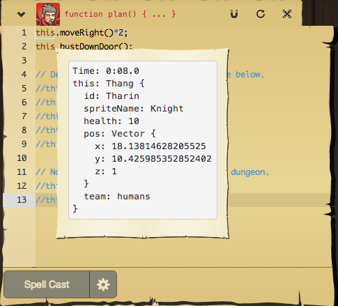
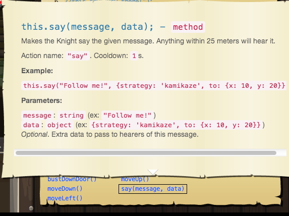

[Week 3 Home](../)

# U1.W3: Design Your Own Code Combat Mission SOLO CHALLENGE

**This is a solo challenge. Refer to the [solo challenge](https://github.com/Devbootcamp/phase-0-handbook/blob/master/solo-challenges.md) guidelines.**

## Learning Competencies
- Define local variables in JavaScript
- Create, add properties to, delete properties from, and access property values of JavaScript Object literals
- BONUS: Integrate HTML, CSS, and JavaScript to display and manipulate objects

## Summary
You now have some practice with JavaScript so let's get creative with it. In this challenge, **you are not expected to create a real, working mission on codecombat.com**, rather, we want you to have fun designing a simple mission and creating some basic objects and functions to manipulate those objects. You don't need to visit Code Combat to do this, just write out your solution in the `my_solution.js` file. The end is up to you. 

This is an open-ended challenge so there are a lot of things you can do with it (and ways to make it really hard or farily simple). It's up to you to decide how much detail you want to go in to. If you are having fun, keep working and solidifying your understanding of JavaScript concepts. If you're bored and feel like you've gotten enough out of it after writing a few objects and functions that work together, consider yourself done. That said, make sure you go through the workflow and complete each release. 

## Release 0: Design your Mission

Remember how Code Combat had goals to complete a mission? Visible at the top left of each challenge?

Write an outline of your overall mission and goals to complete your mission as comments in your [my_solution.js](my_solution.js) file. 

Then consider:
- Who are the main characters in your mission? Write a bit about them. What properties do they have? HINT: You should probably protagonist (and maybe an antagonist). You can actually see what the code combat objects are if you hover over "this." In the image below, we can see the current information for Tharin. Identify the characters (objects) you'll need to create as comments.
- Consider other objects you need. Do you need a sword? What about a cannon, death ray, magic seeds, etc. Write those as comments as well. 

- Think of the functions that you'll need to manipulate your objects to complete the goals. 

You can also view the functions or get documentation on them in Code Combat:

## Release 1: [Pseudocode](https://github.com/Devbootcamp/phase-0-handbook/blob/master/coding-references/pseudocode.md) 

Pseudocode your objects and functions. Write these in plain english and save them as comments. 

*NOTE: Make sure your pseudocode is broken down to easily implementable steps.*

## Release 2: Write your [initial code](https://github.com/Devbootcamp/phase-0-handbook/blob/master/coding-references/initial-solution.md)

Your functions don't have to actually create movement on the screen (unless you want them to), but think about how to pass information between objects using functions. Think about what information the functions need to have access to in order to work. 

If you are doing something like, collecting gold, then you would need to have gold objects, a bag object, and a way to put gold into your bag, as well as a way to see how much gold you have. 

## Release 3: [Refactor](https://github.com/Devbootcamp/phase-0-handbook/blob/master/coding-references/refactoring.md)

## Release 4: [Reflect](https://github.com/Devbootcamp/phase-0-handbook/blob/master/coding-references/reflection-guidelines.md)

## Release 5: Manipulate objects on the DOM (Optional)
Add your JavaScript objects to an HTML page. Use CSS to make it pretty. What about ascii art? Then look up how to manipulate objects on a page with JavaScript using your functions...

